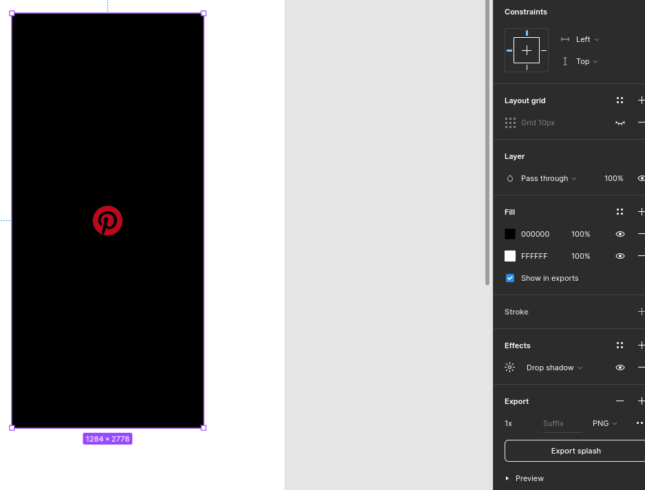

## PROJETO COM REACT-NATIVE CLONE DO PINTEREST

### Projeto desenvolvido com React-Native, Expo, Styled-Components e React-Navigation.

### documentação: https://docs.expo.dev/

* Configurações de ambiente:
  - Node.js
  - Expo
  - Yarn
  - Android Studio
  - Emulador Android

* gerando o projeto:
    ```bash
        $ npx create-expo-app --template
    ```

* configuração em que esta rodando o projeto
    - Node.js v20.11.1
    - React-Native react-native-cli: 2.0.1
    - npx --version: 10.2.4
    - npx expo --version: 0.17.8

* Rodando o projeto:
    ```bash
        $ npx expo start
    ```

* Rodando o projeto no modo clear cache:
    ```bash
        $ npx expo start --clear
    ```


* Instalando font family roboto:
    ```bash
        $ npx expo install expo-font @expo-google-fonts/roboto
    ```

* Instalando o gestor handle: https://docs.expo.dev/versions/latest/sdk/gesture-handler/
    ```bash
        $ npx expo install react-native-gesture-handler
    ```

* usando o figma como ferramenta de design:
    - https://www.figma.com/community/file/1155362909441341285
    


## O que será ensinado nesse projeto:

- [x] Configuração do ambiente
- [x] Instalação de dependências
- [x] Importação de fontes
- [x] SplashScreen para garantir que tudo seja caregado antes de iniciar o app
- [ ] Configuração de navegação